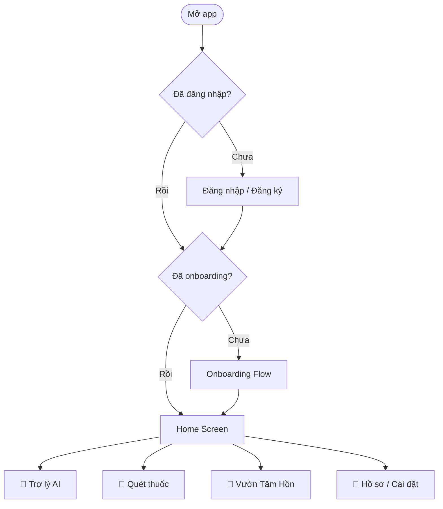

# MediSign AI – Đặc tả Giao diện (UI Specification)

> **Phiên bản:** 1.0 | **Ngày:** 14/02/2026  
> **Dựa trên:** Required.md v1.0, Design.md v1.0

---

## MỤC LỤC

1. [Tổng quan Navigation](#1-tổng-quan-navigation)
2. [Nhóm 1: Authentication](#2-nhóm-1-authentication)
3. [Nhóm 2: Onboarding](#3-nhóm-2-onboarding)
4. [Nhóm 3: Home & Navigation chính](#4-nhóm-3-home--navigation-chính)
5. [Nhóm 4: AI Medical Assistant](#5-nhóm-4-ai-medical-assistant)
6. [Nhóm 5: Camera Quét Thuốc](#6-nhóm-5-camera-quét-thuốc)
7. [Nhóm 6: Vườn Tâm Hồn (Soul Garden)](#7-nhóm-6-vườn-tâm-hồn-soul-garden)
8. [Nhóm 7: Hồ sơ & Cài đặt](#8-nhóm-7-hồ-sơ--cài-đặt)
9. [Nhóm 8: Care Connect (Người thân)](#9-nhóm-8-care-connect-người-thân)
10. [Nhóm 9: Bệnh viện & Bản đồ](#10-nhóm-9-bệnh-viện--bản-đồ)
11. [Nhóm 10: Trạng thái hệ thống](#11-nhóm-10-trạng-thái-hệ-thống)
12. [Quy tắc Accessibility chung](#12-quy-tắc-accessibility-chung)
13. [Thứ tự ưu tiên phát triển](#13-thứ-tự-ưu-tiên-phát-triển)

---

## 1. TỔNG QUAN NAVIGATION

**Bottom Navigation (4 tabs):**

| # | Tab | Icon | Trang chính |
|---|-----|------|-------------|
| 1 | Trợ lý | 🤖 | Chat AI + Triage |
| 2 | Quét thuốc | 💊 | Camera + Tủ thuốc |
| 3 | Vườn Tâm Hồn | 🌱 | Nhật ký + Cây |
| 4 | Tôi | 👤 | Hồ sơ + Cài đặt |

---

## 2. NHÓM 1: AUTHENTICATION

### 2.1 Màn hình Chào mừng (Welcome/Splash)

- **Route:** `/welcome`
- **Nội dung:**
  - Logo MediSign AI + animation nhẹ
  - Slogan: "Hiểu bạn, không chỉ bệnh của bạn"
  - 2 nút lớn: **[Đăng nhập]** và **[Đăng ký]**
  - Link nhỏ: "Dùng thử không cần tài khoản" (chỉ cho phép Offline Fallback)
- **Accessibility:** Nền tương phản cao, nút ≥ 48px, font ≥ 18px

### 2.2 Đăng ký (Register)

- **Route:** `/register`
- **Bước 1 – Thông tin cơ bản:**
  - Email hoặc Số điện thoại
  - Mật khẩu (≥ 8 ký tự, hiển thị/ẩn)
  - Xác nhận mật khẩu
  - Nút **[Tiếp tục]**
- **Bước 2 – Xác thực:**
  - Nhập OTP gửi qua SMS/Email
  - Đếm ngược + nút "Gửi lại"
- **Bước 3 – Thiết lập bảo mật 2 bước:**
  - Chọn phương thức: Sinh trắc (gợi ý) / OTP+Authenticator / Recovery Key
  - Hiển thị Recovery Key (12 từ) → yêu cầu ghi lại
- **States:** Loading (gửi OTP), Error (OTP sai / email trùng), Success (chuyển onboarding)

### 2.3 Đăng nhập (Login)

- **Route:** `/login`
- **Nội dung:**
  - Email/SĐT + Mật khẩu
  - Nút **[Đăng nhập]**
  - Link: "Quên mật khẩu?"
  - Link: "Chưa có tài khoản? Đăng ký"
- **Bước 2:** Xác thực 2 bước (Sinh trắc / OTP / Recovery Key)
- **States:** Loading, Error (sai mật khẩu, bị khóa 15p/24h), Success

### 2.4 Quên mật khẩu (Forgot Password)

- **Route:** `/forgot-password`
- **Luồng:** Nhập Email/SĐT → Nhận OTP → Nhập mật khẩu mới → Thành công

---

## 3. NHÓM 2: ONBOARDING

### 3.1 Onboarding – Giới thiệu (Welcome Slides)

- **Route:** `/onboarding/intro`
- **Nội dung:** 3-4 slides giới thiệu nhanh:
  1. "MediSign AI – Trợ lý sức khỏe hiểu bạn" + hình minh họa
  2. "Hỏi bệnh mọi lúc, mọi nơi" + icon AI chat
  3. "Quét thuốc, kiểm tra tương tác" + icon camera
  4. "Vườn Tâm Hồn – Bạn đồng hành mỗi ngày" + icon cây
- **Điều hướng:** Swipe hoặc nút [Tiếp] / [Bỏ qua]

### 3.2 Onboarding – Hồ sơ sức khỏe ban đầu

- **Route:** `/onboarding/profile`
- **Nội dung (từng bước, 1 câu hỏi/trang):**
  1. "Bạn bao nhiêu tuổi?" → Slider hoặc số
  2. "Giới tính" → 3 nút lớn (Nam / Nữ / Khác)
  3. "Bạn có dị ứng thuốc gì không?" → Text field + gợi ý phổ biến
  4. "Bạn có bệnh nền gì không?" → Checklist (Tiểu đường, Huyết áp, Tim mạch, Không có)
  5. **"Chúng ta giao tiếp qua đâu nhé?"** → Xem [3.2b Communication Method](#32b-onboarding--chọn-cách-giao-tiếp)
- **Nút:** [Tiếp tục] / [Bỏ qua, thiết lập sau]

### 3.2b Onboarding – Chọn cách giao tiếp (Communication Method)

- **Route:** `/onboarding/communication`
- **Mục đích:** Xác định phương thức giao tiếp của user — **không hỏi về khuyết tật**, chỉ liệt kê các kênh giao tiếp có sẵn. User **chọn 1 hoặc nhiều** → App tự tối ưu tổ hợp.
- **Trình bày đồng thời (Multi-Modal Prompt):**
  - 🧑‍⚕️ **Model Y tá 3D** ra ngôn ngữ ký hiệu "Chúng ta giao tiếp qua đâu nhé?"
  - 🔊 **Âm thanh (TTS)** đọc cùng câu hỏi
  - 📝 **Text** hiển thị câu hỏi
  - Tất cả **đồng thời** → bất kỳ ai cũng hiểu được ít nhất 1 kênh
- **4 phương thức — MULTI-SELECT (chọn nhiều được):**

  | Icon | Phương thức | Mô tả | UI khi chọn |
  |------|-------------|-------|-------------|
  | 🎤 | **Nói** (Voice) | Micro + sóng âm | Check ✅ hiện góc card |
  | 🤟 | **Ký hiệu** (Sign Language) | 2 bàn tay | Check ✅ hiện góc card |
  | 👆 | **Chạm** (Tap/Icon) | Ngón tay chạm | Check ✅ hiện góc card |
  | ⌨️ | **Gõ** (Text) | Bàn phím | Check ✅ hiện góc card |

- **Tổ hợp → App tự tối ưu mode:**

  | User chọn | App suy luận | Mode tối ưu |
  |-----------|-------------|-------------|
  | 🎤 only | Có thể khiếm thị / liệt tay | Voice full + TTS |
  | 🤟 only | Điếc + câm | Sign + Pictogram |
  | 👆 only | Mù chữ / điếc + câm | Icon-only + Pictogram |
  | ⌨️ only | Bình thường | Standard text chat |
  | 🎤 + 👆 | Người già, mắt kém | Voice chính + Icon lớn backup |
  | 🤟 + 👆 | Điếc + câm + mù chữ | Sign + Icon/Pictogram |
  | 🎤 + ⌨️ | Bình thường thích tiện | Voice + Text linh hoạt |
  | Tất cả | Bình thường, muốn trải nghiệm | Full access, tự chuyển mode |

- **Implicit Detection (vẫn giữ):** User có thể trả lời bằng BẤT KỲ cách nào:
  - Nói "giọng nói" → Auto-tick 🎤
  - Ra ký hiệu trước camera → Auto-tick 🤟
  - Chạm vào icon 👆 → Auto-tick 👆
  - Gõ text → Auto-tick ⌨️
- **Sau khi chọn:** App xác nhận bằng chính phương thức đó
- **Có thể đổi sau:** Settings → "Cách giao tiếp" bất cứ lúc nào
- **Ngoài scope MVP:** Nhóm vừa mù vừa điếc (~0.2% dân số) cần thiết bị chuyên dụng (braille display), không hỗ trợ trên smartphone thường

### 3.2c Onboarding – Bật "Bác sĩ ơi" (Pre-Permission)

- **Route:** `/onboarding/wake-word`
- **Hiển thị khi:** User đã chọn 🎤 Giọng nói trong bước 3.2b
- **Mục đích:** Giải thích tính năng wake word TRƯỚC KHI popup OS xin mic → tăng tỷ lệ Allow (~85% thay vì ~50%)
- **Nội dung:**
  - Icon 🎤 lớn + tiêu đề: **"Bật 'Bác sĩ ơi'?"**
  - Mô tả: "Chỉ cần nói 'Bác sĩ ơi' là tôi sẽ nghe bạn ngay — không cần mở app, không cần chạm."
  - 3 dòng cam kết:
    - 🔒 "Giọng nói xử lý trên máy, không gửi đi đâu"
    - 🔋 "Tốn ~1% pin/giờ — ít hơn mạng xã hội"
    - ⚙️ "Tắt bất cứ lúc nào trong Cài đặt"
  - **2 nút:** [✅ Bật ngay] → popup OS xin mic | [Để sau] → bỏ qua, dùng Touch
- **Nếu user chọn "Để sau":** App nhắc lại nhẹ nhàng sau 3 ngày sử dụng
- **Logic popup OS:** Chỉ gọi `Permission.microphone.request()` SAU KHI user bấm "Bật ngay"

### 3.3 Onboarding – Chọn chế độ hoạt động

- **Route:** `/onboarding/mode`
- **Nội dung:**
  - App tự nhận diện RAM + mạng → gợi ý chế độ
  - 3 nút lớn (theo Variant B đã thiết kế):
    - 🔀 **Tốt nhất cho tôi** (Hybrid) – gợi ý
    - 🔒 **Riêng tư tuyệt đối** (Local-Only)
    - ☁️ **Nhẹ nhất** (Cloud-Only)
  - Helper text + có thể đổi sau
- **Nếu chọn Local/Hybrid:** Hỏi tải AI model (~1.5GB)
- **States:** Loading (detect device), Downloading (model), Error, Success

### 3.4 Onboarding – Hoàn thành

- **Route:** `/onboarding/complete`
- **⚠️ Lưu ý kỹ thuật (first-time setup):**
  - Lần đầu sử dụng **bắt buộc cần chạm** để cấp quyền microphone/camera (giới hạn OS — iOS & Android đều yêu cầu)
  - Người dùng không thể thao tác tay (khiếm thị nặng, liệt tay) cần **nhờ người thân/tình nguyện viên hỗ trợ setup 1 lần** (~3 phút)
  - Đây là giới hạn chung của mọi app — kể cả Hey Siri, OK Google cũng cần setup bằng tay lần đầu
  - **Sau setup:** App hoạt động hoàn toàn bằng giọng nói, không cần chạm
- **Nội dung:**
  - ✅ "Sẵn sàng rồi!"
  - Tóm tắt: chế độ đã chọn, profile đã nhập
  - Y tá 3D vẫy tay chào
  - Nút **[Bắt đầu dùng MediSign]**

---

## 4. NHÓM 3: HOME & NAVIGATION CHÍNH

### 4.1 Home Screen

- **Route:** `/home`
- **Layout:**
  - **Header:** Chào người dùng ("Chào buổi sáng, [Tên]") + avatar
  - **Nút chính giữa:** 🩺 "Bác sĩ ơi" (to, nổi bật) → mở chat AI
  - **2 nút phụ:**
    - 📸 "Quét thuốc" (trái)
    - 📖 "Nhật ký" (phải)
  - **Card tóm tắt hôm nay:**
    - Tâm trạng hôm nay (emoji)
    - Thuốc cần uống (x/y đã uống)
    - Cây tâm hồn mini preview
  - **Cảnh báo (nếu có):**
    - ⚠️ "Bạn quên uống thuốc sáng nay"
    - 🔴 "Triệu chứng hôm qua cần theo dõi"
- **Bottom Nav:** 4 tabs như mục 1
- **Accessibility:**
  - Voice: "Bác sĩ ơi" wake word kích hoạt AI
  - Người già: font ≥ 24px, nút "Bác sĩ ơi" chiếm 40% màn hình
  - Khiếm thị: TalkBack đọc tất cả phần tử

### 4.2 Notification Center

- **Route:** `/notifications`
- **Nội dung:** Danh sách thông báo (nhắc thuốc, cảnh báo AI, tin care connect)
- **Mỗi item:** Icon + tiêu đề + thời gian + đã đọc/chưa đọc

---

## 5. NHÓM 4: AI MEDICAL ASSISTANT

### 5.1 Chat Screen (Trợ lý AI)

- **Route:** `/assistant`
- **Layout chung:**
  - Y tá 3D ở góc dưới (có thể thu nhỏ/ẩn)
  - Khung chat (tin nhắn dạng bong bóng)
  - Thanh nhập liệu **tự thích ứng** theo Communication Mode đã chọn
  - Disclaimer footer: "Đây là gợi ý AI, không thay thế bác sĩ"
- **Adaptive Input theo Communication Mode:**

  | Mode | Input chính | Input phụ | Output AI |
  |------|------------|-----------|----------|
  | 🎤 Voice | Mic luôn lắng nghe + waveform | Text field (backup) | TTS đọc + text bong bóng |
  | 🤟 Sign | Camera trước live + nhận diện ký hiệu | Body map tap | Avatar y tá ký hiệu phản hồi + pictogram |
  | 👆 Tap | Body map + symptom icon grid | Quick-reply buttons | Icon/pictogram + màu trạng thái (🟢🟡🔴) |
  | ⌨️ Text | Text field + gợi ý nhanh | Voice fallback | Text bong bóng + icon mức độ |

- **Chi tiết từng Mode trong Chat:**
  - **Voice Mode:** Mic icon lớn ở giữa, sóng âm khi đang nghe. User nói triệu chứng → AI phản hồi bằng TTS + text.
  - **Sign Language Mode:** Camera trước hiện ở thanh input (live preview). User ra ký hiệu → AI dịch → hiện text "Bạn nói: [...]" → Avatar y tá 3D phản hồi bằng ký hiệu + pictogram kết quả.
  - **Tap/Icon Mode:** Thay text field bằng **lưới icon triệu chứng** (đau đầu 🤕, sốt 🤒, ho 😷, đau bụng, v.v.) + Body map. AI phản hồi bằng icon + màu + hình ảnh minh họa (không cần đọc chữ).
  - **Text Mode:** Giao diện chat truyền thống với text input, gợi ý nhanh, bong bóng tin nhắn.
- **Tất cả modes đều có:** Nút 🆘 khẩn cấp (gọi 115) luôn hiển thị ở top-right
- **States:** Typing indicator, Error (mất kết nối → chuyển offline), Empty (hướng dẫn bắt đầu theo mode)

### 5.2 Body Map (Chạm hình chỉ vùng đau)

- **Route:** `/assistant/body-map`
- **Nội dung:**
  - Hình người lớn (trước + sau)
  - Chạm vào vùng để chọn (đầu, ngực, bụng, tay, chân...)
  - Highlight vùng đã chọn bằng màu đỏ
- **Accessibility:** Vùng bấm lớn, emoji + label cho mỗi bộ phận

### 5.3 Triage Result (Kết quả sàng lọc)

- **Route:** `/assistant/result`
- **Nội dung:**
  - Mức độ: 🟢 Nhẹ / 🟡 Trung bình / 🔴 Khẩn cấp
  - Lời khuyên chi tiết (text + voice + sign video)
  - Nút hành động:
    - 🟢: "Tự xử lý tại nhà" + hướng dẫn
    - 🟡: "Tìm bệnh viện gần nhất" + bản đồ
    - 🔴: "Gọi 115 NGAY" + nút gọi người thân
  - Nút "Lưu kết quả" vào hồ sơ

### 5.4 First Aid Guide (Sơ cứu)

- **Route:** `/assistant/first-aid`
- **Nội dung:**
  - Danh sách tình huống: Bỏng, Chảy máu, Ngộ độc, Đuối nước, Gãy xương...
  - Mỗi tình huống: Bước 1-2-3 bằng hình ảnh + text + voice
  - Nút "Gọi 115" luôn hiện

---

## 6. NHÓM 5: CAMERA QUÉT THUỐC

### 6.1 Camera Scan Screen (Theo UI_Mau)

- **Route:** `/scanner`
- **Layout:** (dark theme, theo đúng UI_Mau)
  - Nền tối (#1A1A2E), camera viewfinder toàn màn hình
  - **Header:** "Quét thuốc" (trắng, bold) + badge "Tủ thuốc" (cam, góc phải)
  - **Khung scan:** Viền cyan (#00BCD4), hiệu ứng quét
  - **Guide text:** "Đặt vỉ thuốc vào khung hình" (nền bán trong, icon scan)
  - **Nút flash** (góc trên phải, tròn, nền bán trong)
  - **Controls bar (dưới):**
    - 📸 Thư viện (icon hình ảnh, nền xanh nhạt) — chọn ảnh từ gallery
    - 🔘 **Nút chụp tròn lớn** (viền cyan + lõi cyan) — KHÔNG CÓ VOICE
    - 💊 Tủ thuốc (icon pill, nền cam nhạt) — vào tủ thuốc nhanh
  - **KHÔNG có voice command** — camera scan chỉ dùng nút bấm/chạm
- **States:** Scanning (animation quét), Error (không nhận diện), Success (chuyển Result)

### 6.2 Medicine Result — PICTOGRAM-FIRST DESIGN ⭐
>
> **Đây là tính năng ăn tiền nhất cho người mù chữ + điếc.** Mọi thông tin thuốc phải hiểu được qua ẢNH + ICON + MÀU SẮC, không cần đọc chữ.

- **Route:** `/scanner/result`
- **Design Principle:** Icon > Text, Màu > Chữ, Ảnh > Mô tả
- **Layout:**
  - **Ảnh thuốc** (dữ liệu scan hoặc từ DB) — chiếm ~200px trên cùng, nền xanh nhạt
  - **Tên thuốc + hoạt chất** — cỡ lớn, bold. (cho người đọc được)
  - **3 ICON CARDS (hàng ngang):**
    - 💊 **Liều lượng:** Icon pill + "1 viên" (xanh dương, font lớn bold)
    - 🕐 **Tần suất:** Icon clock + "3x/ngày" (cam, font lớn bold)
    - 🛡️ **An toàn:** Icon shield + "An toàn" + chấm xanh lá (xanh lá)
  - **KHI NÀO UỐNG — Visual Time Cards:**
    - 🌅 **Sáng** — icon sunrise, nền vàng nhạt
    - ☀️ **Trưa** — icon sun, nền vàng nhạt
    - 🌙 **Tối** — icon moon, nền tím nhạt
    - *(Cards nào có viền đậm = cần uống lúc đó)*
  - **CHÚ Ý — Warning Cards (hàng ngang, nền đỏ nhạt):**
    - 🌡️ "Khi sốt > 38.5°" — icon nhiệt kế
    - 🍷 "❌ Không rượu bia" — icon rượu + X
    - 🤰 "⚠️ Hỏi BS nếu có thai" — icon baby
  - **Còn X viên** — badge cam, dễ thấy
  - **CTA:** [➕ Thêm vào Tủ thuốc] (xanh lá, full-width)
- **Accessibility Key:**
  - Người mù chữ: Hiểu qua icon + màu + số (1 viên, 3x)
  - Người điếc: Không có voice, chỉ visual
  - Tất cả: Icon cards to, dễ chạm, dễ nhớ

### 6.3 Tủ thuốc cá nhân (My Medicine)

- **Route:** `/scanner/cabinet`
- **Nội dung:**
  - Danh sách thuốc đang dùng
  - Mỗi thuốc: Tên + liều + giờ uống + số viên còn lại
  - Nút [Thêm thuốc] (manual hoặc quét)
  - Nút [Kiểm tra tương tác] → so sánh toàn bộ thuốc trong tủ
- **Notification:** Nhắc uống thuốc đúng giờ

### 6.4 Drug Interaction Check (Kiểm tra tương tác)

- **Route:** `/scanner/interaction`
- **Nội dung:**
  - Hiển thị tất cả cặp thuốc
  - Mức độ: 🟢 An toàn / 🟡 Thận trọng / 🔴 Nguy hiểm
  - Chi tiết tương tác + khuyến cáo

---

## 7. NHÓM 6: VƯỜN TÂM HỒN (SOUL GARDEN)

### 7.1 Soul Garden Home

- **Route:** `/soul-garden`
- **Layout:**
  - **Cây tâm hồn** ở giữa (animation 2D/3D):
    - 🌱 Cây con (mới bắt đầu)
    - 🌿 Cây trưởng thành (viết đều đặn)
    - 🌸 Nở hoa (chuỗi nhật ký tích cực)
    - 🍂 Héo úa (stress kéo dài / không viết)
  - **Stats mini:**
    - 🔥 Chuỗi ngày viết liên tiếp (streak)
    - 📊 Tâm trạng tuần này (biểu đồ mini)
  - **Nút chính:** 📝 "Viết nhật ký hôm nay" (to, nổi bật)
  - **Danh sách nhật ký gần đây** (3-5 entries gần nhất)
  - **Achievement badges** (thành tựu đã mở khóa)

### 7.2 Write Journal (Viết nhật ký)

- **Route:** `/soul-garden/write`
- **Nội dung:**
  - **Bước 1:** "Hôm nay bạn cảm thấy thế nào?"
    - 5 emoji lớn: 😢 😟 😐 🙂 😊
    - Chọn = "tưới cây" animation nhẹ
  - **Bước 2:** "Kể thêm cho MediSign nghe nhé" (tuỳ chọn)
    - Text field lớn
    - Hoặc 🎤 nút voice (nói → tự chuyển text)
    - Tags gợi ý: #stress #mất_ngủ #vui #tập_thể_dục #quên_thuốc
  - **Bước 3:** Lưu → Animation cây lớn thêm 🌿
- **Accessibility:** Voice input, emoji lớn ≥ 48px, không bắt buộc text

### 7.3 Journal History (Lịch sử nhật ký)

- **Route:** `/soul-garden/history`
- **Nội dung:**
  - Lịch tháng (calendar view) với emoji mood mỗi ngày
  - Danh sách dạng timeline
  - Filter: theo mood, theo tag, theo tháng
  - Tap vào entry → xem chi tiết + AI analysis

### 7.4 Mood Analytics (Phân tích tâm trạng)

- **Route:** `/soul-garden/analytics`
- **Nội dung:**
  - Biểu đồ mood 7 ngày / 30 ngày / 3 tháng
  - Xu hướng: "Bạn vui hơn 20% so với tuần trước"
  - Tags phổ biến: "stress" xuất hiện 5 lần tuần này
  - AI insight: "Bạn thường mệt vào thứ 2. Hãy thử ngủ sớm hơn Chủ nhật."
  - ⚠️ Cảnh báo nếu phát hiện xu hướng tiêu cực kéo dài → gợi ý gặp chuyên gia

### 7.5 Achievement & Tree Collection (Thành tựu)

- **Route:** `/soul-garden/achievements`
- **Nội dung:**
  - Danh sách thành tựu: "Viết 7 ngày liên tiếp", "Tháng tích cực", "Cây đầu tiên nở hoa"
  - Bộ sưu tập cây đã mở khóa (các loại cây khác nhau)
  - Tiến độ achievement tiếp theo

---

## 8. NHÓM 7: HỒ SƠ & CÀI ĐẶT

### 8.1 Profile Screen (Hồ sơ cá nhân)

- **Route:** `/profile`
- **Nội dung:**
  - Avatar + Tên + Tuổi
  - Hồ sơ sức khỏe (tiền sử, dị ứng, bệnh nền)
  - Nút [Chỉnh sửa hồ sơ]
  - Thống kê: Số lần hỏi AI, Số ngày viết nhật ký, Cây level
  - Liên kết nhanh: [Tủ thuốc] [Lịch sử tư vấn] [Care Connect]

### 8.2 Settings Screen (Cài đặt)

- **Route:** `/settings`
- **Nội dung:**
  - **Chế độ hoạt động:** Hybrid / Local / Cloud (đổi được)
  - **Accessibility:**
    - Font size: Nhỏ / Trung bình / Lớn / Rất lớn
    - Tương phản cao: Bật/Tắt
    - Voice-only mode: Bật/Tắt (cho người khiếm thị)
    - Wake word: Bật/Tắt + tùy chỉnh ("Bác sĩ ơi")
  - **Thông báo:**
    - Nhắc uống thuốc: Bật/Tắt
    - Nhắc viết nhật ký: Bật/Tắt
    - Cảnh báo sức khỏe: Bật/Tắt
  - **Bảo mật:**
    - Đổi mật khẩu
    - Quản lý 2FA
    - Quản lý thiết bị (xem danh sách, đăng xuất từ xa)
    - Recovery Key (xem lại / tạo mới)
  - **Dữ liệu:**
    - Backup dữ liệu (Cloud backup)
    - Xóa dữ liệu cục bộ
    - Xuất hồ sơ sức khỏe (PDF)
  - **Về ứng dụng:**
    - Phiên bản, giấy phép, feedback
  - Nút **[Đăng xuất]**

### 8.3 Consultation History (Lịch sử tư vấn)

- **Route:** `/profile/history`
- **Nội dung:**
  - Danh sách các lần hỏi AI (ngày + tóm tắt + mức độ)
  - Tap → xem chi tiết cuộc hội thoại

### 8.4 Edit Profile (Chỉnh sửa hồ sơ)

- **Route:** `/profile/edit`
- **Các field:** Tên, tuổi, giới tính, tiền sử bệnh, dị ứng, loại khuyết tật

---

## 9. NHÓM 8: CARE CONNECT (NGƯỜI THÂN)

### 9.1 Care Connect Setup

- **Route:** `/care-connect/setup`
- **Nội dung:**
  - "Mời người thân theo dõi sức khỏe của bạn"
  - Nhập email/SĐT người thân → gửi lời mời
  - Chọn quyền: Xem thuốc / Nhận cảnh báo / Xem mood
  - Danh sách người đã kết nối + trạng thái (chờ / hoạt động)

### 9.2 Care Connect Dashboard (Bên người thân)

- **Route:** `/care-connect/dashboard`
- **Nội dung:**
  - Trạng thái người dùng: 🟢 Bình thường / 🟡 Cần chú ý / 🔴 Khẩn cấp
  - Tuân thủ thuốc hôm nay: x/y đã uống
  - Tâm trạng gần nhất (emoji + tóm tắt)
  - Lần check-in cuối: "2 giờ trước"
  - Nút: [Gọi điện] [Gửi tin nhắn động viên]
  - ⚠️ Cảnh báo push notification khi có bất thường

---

## 10. NHÓM 9: BỆNH VIỆN & BẢN ĐỒ

### 10.1 Hospital Finder (Tìm bệnh viện)

- **Route:** `/hospitals`
- **Nội dung:**
  - Bản đồ với pin các BV gần
  - Danh sách BV: Tên + Khoảng cách + Chuyên khoa + BHYT
  - Filter: Chuyên khoa, khoảng cách, BHYT
  - Gợi ý dựa trên kết quả triage ("Bạn nên khám Tiêu hóa")
- **Mỗi BV:** Tap → trang chi tiết

### 10.2 Hospital Detail

- **Route:** `/hospitals/:id`
- **Nội dung:**
  - Tên + Địa chỉ + SĐT + giờ làm việc
  - Chuyên khoa
  - BHYT: Có/Không
  - Nút: [Chỉ đường] [Gọi điện] [Lưu vào danh sách]

---

## 11. NHÓM 10: TRẠNG THÁI HỆ THỐNG

### 11.1 Offline Mode Screen

- **Hiển thị khi:** Mất kết nối internet
- **Nội dung:**
  - Banner "Bạn đang offline"
  - Nếu có Local LLM: "AI vẫn hoạt động (bản nhẹ)"
  - Nếu không: "Dùng chế độ tra cứu cơ bản" → Decision Tree
  - Các tính năng khả dụng (tủ thuốc, nhật ký, sơ cứu)
  - Các tính năng không khả dụng (chat AI cloud, quét thuốc cloud, bản đồ)

### 11.2 Model Download Screen

- **Route:** `/download-model`
- **Hiển thị khi:** Chọn Local/Hybrid mode lần đầu
- **Nội dung:**
  - "Tải AI về máy (~1.5GB)"
  - Progress bar + % + ước tính thời gian
  - "Cần WiFi. Chỉ tải 1 lần."
  - Nút [Tải sau] (dùng Cloud tạm)

### 11.3 Emergency Fallback

- **Hiển thị khi:** Mọi thứ đều lỗi
- **Nội dung:**
  - Nút **GỌI 115** cực to (đỏ, giữa màn hình)
  - Nút gọi người thân
  - "MediSign đang gặp sự cố. Vui lòng gọi cấp cứu nếu cần."

---

## 11b. NHÓM 11: AI FITNESS COACH (Module 6)

### 11b.1 Fitness Flow Entry Point

- **Truy cập từ:** Dashboard → Card "Tập thể dục" (icon 🏋️, màu vàng #F59E0B)
- **Voice command:** "Tập thể dục" hoặc "Tập luyện" → mở Fitness Flow
- **Luồng:** Goal Selection → Exercise Selection → Workout Session → Summary

### 11b.2 Màn hình Chọn mục tiêu (Goal Selection)

- **Route:** Dashboard → FitnessFlow → GoalPage
- **Layout:**
  - AppBar xanh (#059669), title "Tập thể dục", font Outfit Bold
  - Gradient background (#F0FDF4 → white)
  - Header: "Bạn muốn đạt được gì?" (Outfit, 26px, w800)
  - Subtitle: "Chúng tôi sẽ gợi ý bài tập phù hợp với mục tiêu của bạn"
  - 3 Goal Cards (white, border #E5E7EB, border-radius 16px):
    - 🔥 **Giảm cân** — Cardio, HIIT, giảm mỡ (cam #F97316)
    - 🏋️ **Tăng cơ** — Sức mạnh, tăng cơ bắp (xanh dương #3B82F6)
    - ❤️ **Duy trì** — Giữ dáng, sức khỏe tổng thể (xanh lá #059669)
  - Disclaimer vàng: "AI chỉ mang tính tham khảo..."
- **Accessibility:** Semantics label trên mỗi card, tap target ≥ 48px, HapticFeedback

### 11b.3 Màn hình Chọn bài tập (Exercise Selection)

- **Route:** FitnessFlow → ExerciseSelectionPage
- **Layout:**
  - AppBar xanh (#059669), title "Chọn bài tập"
  - Banner gradient xanh: hiện mục tiêu đã chọn + số bài tập
  - Danh sách bài tập (ListView):
    - Mỗi card: Icon (theo nhóm cơ) + Tên VN + Mô tả + Muscle tags
    - Màu theo target area: lower_body=#3B82F6, upper_body=#F97316, core=#8B5CF6
  - 5 bài tập MVP: Squat, Push-up, Plank, Lunge, Deadlift
  - Warning bar vàng: "Khởi động trước khi tập để tránh chấn thương"
- **Accessibility:** Semantics trên mỗi exercise card, muscle tag badges

### 11b.4 Màn hình Workout Session (Real-time Pose Detection)

- **Route:** FitnessFlow → FitnessWorkoutPage
- **Layout:**
  - Nền đen, camera preview (front, mirror) chiếm 3/4 trên
  - Skeleton overlay (CustomPaint) — xanh lá khi form tốt, cam khi cần cải thiện
  - Badge "Form: XX%" góc trên trái (xanh/cam theo score)
  - Panel dưới (dark #1E1E1E, border-radius top 24px):
    - Feedback text (18px, trắng, căn giữa)
    - Stats row: Reps | Tốt | Cần cải thiện
    - 2 nút: [Dừng] outline + [Hoàn thành] xanh #0D9B6B
- **Công nghệ:** Google ML Kit Pose Detection (stream mode), tính góc khớp real-time
- **States:** Loading (spinner), Camera error, No body detected, Active workout

### 11b.5 Màn hình Summary (Sau khi hoàn thành)

- **Hiển thị:** Dialog với icon trophy/dumbbell, Form Score %, Tổng reps, Reps tốt
- **Action:** [Hoàn thành] → quay về Goal Selection

### 11b.6 Voice Script — Fitness

| Bước | App nói (TTS) | User có thể nói | App làm |
|------|--------------|-----------------|---------|
| Mở | "Bạn muốn tập gì hôm nay? Giảm cân, tăng cơ, hay duy trì?" | "Giảm cân" | Chọn goal |
| Chọn bài | "Đây là danh sách bài tập. Nói tên bài tập để bắt đầu." | "Squat" / "Chống đẩy" | Chọn exercise |
| Tập | "Sẵn sàng! Đứng trước camera và bắt đầu." | — | Bật camera + pose detection |
| Feedback | "Hạ thêm một chút! Góc đầu gối chưa đủ." | — | Real-time voice feedback |
| Xong | "Tuyệt vời! Bạn đã hoàn thành X reps với form score Y%." | "Tập tiếp" / "Về trang chủ" | Action tương ứng |

---

## 12. QUY TẮC ACCESSIBILITY CHUNG

Áp dụng cho **TẤT CẢ** các màn hình:

### 12.1 Visual

| Quy tắc | Giá trị |
|---------|---------|
| Font size tối thiểu | 16px (body), 24px (elderly mode) |
| Tap target tối thiểu | 48x48px |
| Contrast ratio | ≥ 4.5:1 (AA), ≥ 7:1 (elderly mode AAA) |
| Nút chính (CTA) | Full-width, padding ≥ 16px, border-radius 16px |
| Màu sắc | Không dùng màu làm phương tiện duy nhất truyền tải thông tin |

### 12.2 Interaction

| Quy tắc | Mô tả |
|---------|-------|
| Semantic labels | Mọi element tương tác đều có `Semantics` label |
| Focus order | Logical top-to-bottom, left-to-right |
| Screen reader | Tương thích TalkBack (Android) + VoiceOver (iOS) |
| Voice control | **Voice-First Mode:** App lắng nghe ngay từ lúc mở `Start listening on launch`. Hỗ trợ hoàn toàn bằng giọng nói (Navigation, Input, Action). Phản hồi bằng giọng nói (TTS) cho mọi hành động. |
| Timeout | Không có timeout trên bất kỳ màn hình nào. Tự động nhắc lại nếu không có phản hồi trong Voice Mode. |

### 12.3 Layout

| Quy tắc | Mô tả |
|---------|-------|
| Overflow | `SingleChildScrollView` hoặc `ListView` trên mọi trang |
| Text scale | Hoạt động tốt ở textScaleFactor 1.0 → 2.0 |
| Screen size | Test 320px → 428px chiều rộng |
| Orientation | Portrait-only (đơn giản hơn cho người già) |

### 12.4 States (Bắt buộc trên mọi trang có data)

| State | Mô tả |
|-------|-------|
| Loading | Spinner + text "Đang tải..." |
| Empty | Hình minh họa + hướng dẫn bắt đầu |
| Error | Thông báo lỗi đơn giản + nút [Thử lại] |
| Success | Phản hồi visual + haptic (rung nhẹ) |
| Offline | Banner + danh sách tính năng khả dụng |
| Voice Listening | Visual indicator (sóng âm / mic icon) luôn hiển thị khi Voice Mode bật |

### 12.5 UNIVERSAL APP CONTROL SYSTEM ⭐

> **Nguyên tắc cốt lõi:** TOÀN BỘ app có thể điều khiển qua **Giọng nói**, **Ký hiệu tay**, hoặc **Chạm màn hình** — KHÔNG cần gõ chữ (trừ nhập nội dung nâng cao). App thân thiện với MỌI người dùng.

#### 12.5.1 Ba kênh điều khiển

| Kênh | Input | Output | Ghi chú |
|------|-------|--------|---------|
| 🎤 **Giọng nói** | User nói → App nghe + hiểu | App nói TTS + hiển thị | Điều khiển mọi thứ, kể cả navigation |
| 🤟 **Ký hiệu tay** | Camera trước nhận diện VSL | Avatar ký hiệu + pictogram + haptic | Navigation bằng ký hiệu đặc biệt |
| 👆 **Chạm** | Tap icon/nút trên màn hình | Visual feedback + haptic | Cách truyền thống, luôn khả dụng |

#### 12.5.2 Wake Word & Always-On Listening

- **Wake word:** "Bác sĩ ơi" hoặc "MediSign"
- **Công nghệ:** Picovoice Porcupine / TFLite keyword model (~2MB, chạy trên CPU low-power)
- Khi đã chọn Voice Mode + đã cấp mic → App **luôn lắng nghe** (always-on)
- Indicator: 🎤 icon nhỏ ở góc trên, animation sóng âm khi đang nghe

- **Hành vi theo trạng thái user:**

  | Trạng thái | Nói "Bác sĩ ơi" | App làm |
  |-----------|-----------------|--------|
  | Đã đăng nhập | Wake word | → **Thẳng vào AI Chat** + "Tôi đang nghe đây, bác kể đi" |
  | Chưa đăng nhập (hiếm) | Wake word | → Welcome + hướng dẫn đăng ký bằng voice |
  | Đang dùng app | Wake word | → Focus mic, lắng nghe ở màn hình hiện tại |

- **Pin & Hiệu năng:**
  - Chờ wake word: ~1-2% pin/giờ (ít hơn mạng xã hội chạy nền)
  - Active listening: ~5-8% pin/giờ, chỉ bật vài phút mỗi lần
  - Không gây nóng, không lag — model 2MB, dùng CPU nhẹ
  - Battery Saver: Khi pin < 20% → tự tắt always-on, chỉ nghe khi mở app

- **Quyền riêng tư:**
  - Audio xử lý 100% trên máy → xóa ngay sau khi nhận diện
  - KHÔNG ghi âm, KHÔNG gửi audio lên cloud
  - Chỉ **text** kết quả (sau STT) mới gửi AI cloud (nếu Cloud mode)
  - User tắt/bật bất kỳ lúc nào: Settings → "Luôn lắng nghe"

#### 12.5.3 Voice Script — Luồng hoàn chỉnh từ đầu đến cuối

> Mỗi màn hình có: **App nói gì** (TTS) + **User nói gì** (voice command) + **App làm gì** (action)

---

**📱 MÀN HÌNH SPLASH / WELCOME**

| Bước | App nói (TTS) | User có thể nói | App làm |
|------|--------------|-----------------|---------|
| 1 | "Xin chào! Tôi là MediSign — trợ lý sức khỏe của bạn. Bạn có thể ấn Tiếp tục để xem giới thiệu, hoặc nói cho tôi biết bạn cần gì." | — | Hiển thị Welcome |
| 2a | — | "Tiếp tục" / "Xem giới thiệu" | Chuyển slide giới thiệu |
| 2b | — | "Bỏ qua" / "Không cần" | Nhảy tới Login/Register |
| 2c | — | "Tôi muốn tả bệnh" / "Tôi bị đau" | App nói: "Để tôi hỗ trợ, bác cần đăng nhập trước. Nếu chưa có tài khoản, nói 'đăng ký' để tôi giúp." |

---

**🔐 ĐĂNG NHẬP / ĐĂNG KÝ (Voice-Guided Form)**

| Bước | App nói (TTS) | User có thể nói | App làm |
|------|--------------|-----------------|---------|
| 1 | "Bác đã có tài khoản chưa? Nói 'đăng nhập' nếu có, hoặc 'đăng ký' nếu chưa." | "Đăng nhập" / "Đăng ký" | Chuyển form tương ứng |
| 2 (Register) | "Bác tên gì ạ?" | "Nguyễn Văn A" | Tự điền vào ô Tên |
| 3 | "Số điện thoại của bác là gì ạ?" | "0912 345 678" | Tự điền + gửi OTP |
| 4 | "Tôi vừa gửi mã xác nhận qua tin nhắn. Bác đọc 6 số cho tôi." | "1 2 3 4 5 6" | Xác nhận OTP |
| 5 | "Đăng ký thành công! Giờ mình thiết lập hồ sơ sức khỏe nhé." | "Đồng ý" / "Bỏ qua" | → Onboarding |
| — (Login) | "Bác cho tôi số điện thoại." → OTP → "Chào mừng bác trở lại!" | — | → Home |

---

**📋 ONBOARDING (Voice-Guided Profile Setup)**

| Bước | App nói (TTS) | User có thể nói | App làm |
|------|--------------|-----------------|---------|
| 1 | "Bác bao nhiêu tuổi ạ?" | "65" / "Sáu mươi lăm" | Điền age slider |
| 2 | "Bác là nam, nữ, hay khác ạ?" | "Nam" / "Nữ" / "Khác" | Chọn giới tính |
| 3 | "Bác có dị ứng thuốc gì không?" | "Không có" / "Penicillin" / "Không biết" | Điền hoặc bỏ qua |
| 4 | "Bác có bệnh nền gì không? Ví dụ tiểu đường, huyết áp..." | "Huyết áp" / "Không có" | Tick checklist |
| 5 | "Chúng ta giao tiếp qua đâu nhé? Giọng nói, ký hiệu tay, chạm màn hình, hay gõ chữ? Bác có thể chọn nhiều cách." | "Giọng nói" / "Giọng nói và chạm" | Multi-select modes |
| 6 | "Bác muốn dùng AI trên máy, trên mạng, hay tự động chọn?" | "Tự động" / "Trên máy" | Chọn Hybrid/Local/Cloud |
| 7 | "Xong rồi! Mình bắt đầu nhé!" | "Đồng ý" | → Home |

---

**🏠 HOME SCREEN (Voice-Guided Introduction)**

| Bước | App nói (TTS) | User có thể nói | App làm |
|------|--------------|-----------------|---------|
| Lần đầu | "Đây là trang chính. Bác có thể nói 'Bác sĩ ơi' bất cứ lúc nào để tôi lắng nghe. Nói 'quét thuốc' để mở camera, 'vườn tâm hồn' để viết nhật ký, hoặc kể triệu chứng để tôi tư vấn." | — | Giới thiệu |
| — | — | "Tôi bị đau đầu" | → Mở AI Chat + bắt đầu triage |
| — | — | "Quét thuốc" | → Mở Camera Scan |
| — | — | "Vườn tâm hồn" / "Viết nhật ký" | → Mở Soul Garden |
| — | — | "Tủ thuốc" | → Mở Medicine Cabinet |
| — | — | "Cấp cứu" / "Gọi 115" | → Gọi 115 ngay |

---

**💬 AI CHAT (Voice-Controlled Conversation)**

| Bước | App nói (TTS) | User có thể nói | App làm |
|------|--------------|-----------------|---------|
| Mở | "Tôi đang nghe đây. Bác kể triệu chứng cho tôi nhé." | — | Mic active |
| — | — | "Tôi bị đau đầu 2 ngày rồi, kèm sốt nhẹ" | AI xử lý → TTS đọc follow-up |
| Follow-up | "Bác đau đầu vùng nào? Trán, thái dương, hay sau gáy?" | "Thái dương" | Tiếp tục hỏi |
| Kết quả | "Theo đánh giá, mức độ nhẹ. Bác nên nghỉ ngơi và uống nhiều nước. Nói 'chi tiết' để xem thêm, hoặc 'lưu' để lưu kết quả." | "Chi tiết" / "Lưu" / "Về trang chủ" | Action tương ứng |

---

**📷 CAMERA SCAN**

| Bước | App nói (TTS) | User có thể nói | App làm |
|------|--------------|-----------------|---------|
| Mở | "Camera đã bật. Đặt vỉ thuốc vào khung hình rồi chạm nút chụp." | — | Mở camera |
| — | — | *(Không có voice command — chỉ chạm)* | — |
| Sau chụp | "Đang nhận diện thuốc... Đây là Paracetamol 500mg. Uống 1 viên, 3 lần mỗi ngày, khi sốt trên 38 độ 5. Nói 'thêm vào tủ' để lưu." | "Thêm vào tủ" / "Quét tiếp" / "Về trang chủ" | Action |

---

**🌿 SOUL GARDEN**

| Bước | App nói (TTS) | User có thể nói | App làm |
|------|--------------|-----------------|---------|
| Mở | "Đây là vườn tâm hồn của bác. Cây đang ở mức [X]. Nói 'viết nhật ký' để bắt đầu." | — | Hiển thị cây |
| — | — | "Viết nhật ký" | → Mở journal |
| Viết | "Hôm nay bác cảm thấy thế nào?" | "Hôm nay tôi thấy vui vì được đi dạo" | Ghi lại + phân tích |
| Xong | "Tôi đã lưu nhật ký. Cây của bác lên thêm 1 lá! Nói 'về trang chủ' hoặc tiếp tục." | "Về trang chủ" | → Home |

---

**⚙️ SETTINGS**

| Bước | App nói (TTS) | User có thể nói | App làm |
|------|--------------|-----------------|---------|
| Mở | "Đây là cài đặt. Bác muốn thay đổi gì?" | — | Hiển thị settings |
| — | — | "Đổi cách giao tiếp" | → Communication Method |
| — | — | "Chữ to hơn" / "Chữ nhỏ lại" | Thay đổi font size |
| — | — | "Đổi chế độ AI" | → Local/Cloud/Hybrid |

---

#### 12.5.4 Voice Command toàn cục (hoạt động mọi màn hình)

| Lệnh voice | Hành động |
|------------|-----------|
| "Bác sĩ ơi" / "MediSign" | Wake up / bắt đầu lắng nghe |
| "Về trang chủ" | → Home |
| "Quay lại" | → Back (màn hình trước) |
| "Cấp cứu" / "Gọi 115" | → Gọi cấp cứu ngay |
| "Quét thuốc" | → Camera Scan |
| "Tủ thuốc" | → Medicine Cabinet |
| "Viết nhật ký" | → Soul Garden Journal |
| "Cài đặt" | → Settings |
| "Đọc lại" / "Nói lại" | App nhắc lại câu TTS cuối |
| "Giúp tôi" / "Hướng dẫn" | App giải thích trang hiện tại |
| "Dừng lại" / "Im đi" | Tắt TTS, tiếp tục lắng nghe |

#### 12.5.5 Sign Language Navigation (Ký hiệu điều hướng)

| Ký hiệu | Hành động | Mô tả cử chỉ |
|----------|-----------|---------------|
| 👋 Vẫy tay | Wake up / thu hút chú ý | Vẫy 1 tay trước camera |
| 👆 Chỉ lên | Scroll lên / Back | Ngón trỏ hướng lên |
| 👇 Chỉ xuống | Scroll xuống / Next | Ngón trỏ hướng xuống |
| ✋ Giơ bàn tay | Dừng / Hủy | Bàn tay mở, lòng bàn tay hướng camera |
| 👍 Ngón cái lên | Đồng ý / OK / Tiếp tục | Thumbs up |
| 👎 Ngón cái xuống | Không / Hủy / Quay lại | Thumbs down |
| 🤟 ILY sign | Mở AI Chat | Ký hiệu "I Love You" ASL |
| ✌️ Peace sign | Mở Camera Scan | 2 ngón |

#### 12.5.6 Touch Navigation (luôn khả dụng)

- Mọi nút/icon bấm được, tap target ≥ 48x48px
- Swipe left/right để chuyển tab
- Long press để nghe mô tả (TTS đọc label)
- Bottom navigation bar luôn hiện
- 🆘 Button luôn fixed ở góc trên

#### 12.5.7 Nguyên tắc chung

- **3 kênh đồng thời:** App luôn hiển thị visual + phát audio + rung haptic (tùy mode đã chọn)
- **Không timeout:** Không bao giờ tắt mic/camera vì user im quá lâu. Chỉ nhắc sau 30s: "Tôi vẫn đang nghe đây."
- **Fallback graceful:** Nếu voice không nhận diện → "Xin lỗi, tôi chưa nghe rõ. Bác nói lại hoặc chạm màn hình nhé."
- **Context-aware:** Voice command hiểu theo ngữ cảnh. VD: ở Camera → "chụp" = chụp ảnh. Ở Chat → "chụp" = không có hành động.
- **Error handling:** Mọi lỗi đều có TTS thông báo + icon visual + rung
- **Ngoài scope MVP:** Nhóm vừa mù vừa điếc (~0.2%) cần braille display — không hỗ trợ smartphone thường

---

## 12. NHÓM 12: CỘNG ĐỒNG LẠC QUAN (Community Social Network)

> **Mục đích:** Tạo không gian chia sẻ tích cực, kết nối giữa người dùng — đặc biệt giúp **chống cô đơn** (một dạng bệnh tâm lý). Người dùng được **ẩn danh hoàn toàn**, không dùng tên thật, giao tiếp qua bảng tin và chat.

### 12.1 Nguyên tắc cốt lõi

| Quy tắc | Mô tả |
|---------|-------|
| **Ẩn danh bắt buộc** | Mọi user đều dùng biệt danh (nickname), KHÔNG bao giờ hiện tên thật, SĐT, hay thông tin cá nhân |
| **Kiểm duyệt trước** | TẤT CẢ bài viết phải qua hệ thống kiểm duyệt (AI auto + manual review) TRƯỚC KHI đăng lên bảng tin |
| **Tích cực & an toàn** | Nội dung ưu tiên: chia sẻ thành tựu, kinh nghiệm bệnh tật, giải pháp, động viên. Cấm: lừa đảo, bán thuốc, quấy rối |
| **Hỗ trợ tâm lý** | Tích hợp: hotline tâm lý, câu nói lạc quan hàng ngày, phát hiện user cần hỗ trợ |

### 12.2 Hệ thống danh tính ẩn danh

- **Khi đăng ký tài khoản:** User tự chọn nickname (VD: "Người lạc quan", "Bạn đồng hành")
- **Avatar:** Tự chọn từ bộ emoji/icon có sẵn (🌸🌿🦋🌻🐱...) — KHÔNG dùng ảnh thật
- **Unique ID hiển thị:** Mã ngẫu nhiên (VD: #LQ2024) — dùng để tìm bạn
- **Profile công khai:** Chỉ hiện nickname, avatar emoji, ngày tham gia, số bài viết, huy hiệu thành tựu
- **Không cho phép:** Upload ảnh cá nhân, chia sẻ SĐT, email, CCCD, địa chỉ

### 12.3 Trang chính Cộng đồng (Community Feed)

- **Route:** Tab thứ 3 trong Bottom Navigation (icon 👥)
- **Layout:**
  - **Header:** "Cộng đồng lạc quan" + nút ➕ đăng bài
  - **Lời nhắn hôm nay (Daily Affirmation):** Card nổi bật, xoay vòng câu nói tích cực mỗi ngày
    - VD: "Bạn không đơn độc. Chúng tôi ở đây cùng bạn 💛"
  - **Mood Check-in:** 5 emoji (😢😟😐🙂😊) — bày tỏ tâm trạng nhanh
  - **Bộ lọc chủ đề (Category Pills, scroll ngang):**
    - Tất cả | 🙏 Biết ơn | 💪 Động viên | 💛 Hỗ trợ tâm lý | 🌿 Mẹo sinh hoạt | 💊 Chia sẻ sức khỏe | 🏥 Kinh nghiệm điều trị | ❓ Hỏi đáp | 💬 Chung
  - **Bảng tin (Post Feed):** Danh sách bài viết dạng card
    - Mỗi card: Avatar emoji + Nickname + Thời gian + Category badge
    - Nội dung + Tags (#biết_ơn, #cô_đơn, #mạnh_mẽ...)
    - Actions: ❤️ Thích | 💬 Bình luận | 🔖 Lưu
    - Disclaimer y tế (nếu bài có nội dung sức khỏe)
  - **Hỗ trợ tâm lý (Loneliness Support):** Phần cuối trang
    - 📞 Đường dây tư vấn tâm lý (1800-599-920)
    - 🏥 Tư vấn tâm lý trực tuyến
    - 🧘 Bài tập thở & thiền
    - 💬 Cộng đồng hỗ trợ
- **Accessibility:** Font ≥ 16px, tap target ≥ 48px, Voice: "Cộng đồng" để mở

### 12.4 Đăng bài viết (Create Post)

- **Truy cập từ:** Nút ➕ trên trang Cộng đồng
- **Layout:**
  - **Gợi ý tích cực:** "💡 Chia sẻ điều tốt đẹp hôm nay hoặc gửi lời động viên đến ai đó!"
  - **Chọn chủ đề:** Mặc định = 🙏 Biết ơn
  - **Nội dung:** Text field lớn, hint text thay đổi theo chủ đề
    - Biết ơn → "3 điều bạn biết ơn hôm nay..."
    - Động viên → "Gửi lời động viên đến ai đó..."
    - Hỗ trợ tâm lý → "Tâm sự hoặc cần hỗ trợ..."
  - **Tags:** Thêm hashtag tùy chỉnh
  - **Tùy chọn:**
    - Đăng ẩn danh: Luôn bật (bắt buộc ẩn danh)
    - Thêm disclaimer y tế: Tự động bật cho category sức khỏe
  - **Kiểm duyệt preview:** Nút 👁️ xem trước kết quả kiểm duyệt AI
  - **Quy tắc cộng đồng:** Hiện ở cuối form
    - Không chia sẻ thông tin cá nhân
    - Không quảng cáo, mua/bán thuốc
    - Tôn trọng và lan tỏa yêu thương
- **Luồng sau đăng:**
  1. Bài viết → AI kiểm duyệt tự động (PII, scam, medical claim)
  2. Nếu sạch → Status = `approved` → hiện ngay trên bảng tin
  3. Nếu có flag → Status = `pending` → chờ admin review
  4. Nếu vi phạm nặng → Status = `rejected` → thông báo cho user

### 12.5 Chi tiết bài viết (Post Detail)

- **Truy cập từ:** Tap vào bài viết trên bảng tin
- **Layout:**
  - Nội dung đầy đủ + tags + disclaimer
  - Actions: ❤️ Thích | 🔖 Lưu | 🚩 Báo cáo
  - **Prompt động viên:** "💬 Gửi lời động viên để tạo niềm vui cho mọi người!"
  - **Phần bình luận:**
    - Danh sách comment dạng card
    - Mỗi comment: Avatar emoji + Nickname + Thời gian + Nội dung + ❤️ Thích
    - Input: "Gửi lời động viên..." + nút Gửi
    - Comment cũng đăng ẩn danh
- **Báo cáo vi phạm:** Dialog chọn lý do (Lừa đảo, Thông tin sai, Quấy rối, Không phù hợp, Vi phạm riêng tư, Spam, Khác)

### 12.6 Tìm bạn & Chat (Friend & Messaging)

> ⚠️ **Phase 2 Feature** — Triển khai sau MVP

- **Tìm bạn:**
  - Tìm theo mã ID (#LQ2024)
  - Gợi ý bạn bè: dựa trên chủ đề quan tâm giống nhau, tags hay dùng
  - Gửi lời mời kết bạn (ẩn danh)
- **Chat 1-1:**
  - Nhắn tin text giữa 2 user (ẩn danh)
  - Gửi emoji, sticker động viên
  - Không cho phép: gửi ảnh, video, link, SĐT, email
  - Moderation: AI quét tin nhắn real-time, cảnh báo nếu phát hiện PII hoặc nội dung nguy hiểm
- **An toàn:**
  - Block user bất kỳ lúc nào
  - Báo cáo cuộc trò chuyện
  - Xóa tin nhắn đã gửi (trong 5 phút)

### 12.7 Hệ thống kiểm duyệt (Content Moderation)

- **AI Auto-Moderation (trước khi đăng):**
  - Phát hiện PII: SĐT, email, CMND, địa chỉ → chặn + gợi ý xóa
  - Phát hiện lừa đảo: bán thuốc, MLM, quảng cáo → chặn
  - Phát hiện y tế sai: "thuốc này chữa được ung thư" → flag + yêu cầu disclaimer
  - Phát hiện ngôn ngữ tiêu cực nặng: xúc phạm, đe dọa → chặn
- **Manual Moderation (admin panel):**
  - Dashboard: Tổng bài, chờ duyệt, đã duyệt hôm nay, bị từ chối
  - Duyệt/từ chối bài viết flagged
  - Xem lý do bị flag + severity
- **User Reporting:**
  - Người dùng có thể báo cáo bài viết/comment vi phạm
  - Bài bị report ≥ 3 lần → auto-flag cho admin review

### 12.8 Voice Script — Cộng đồng

| Bước | App nói (TTS) | User có thể nói | App làm |
|------|--------------|-----------------|---------|
| Mở | "Đây là cộng đồng lạc quan. Bạn có thể đọc bài chia sẻ hoặc nói 'đăng bài' để chia sẻ điều tốt đẹp." | — | Hiển thị feed |
| — | — | "Đăng bài" | → Mở Create Post |
| — | — | "Đọc bài mới nhất" | TTS đọc bài đầu tiên |
| — | — | "Bình luận" / "Động viên" | → Mở comment input |
| — | — | "Về trang chủ" | → Home |

---

## 13. THỨ TỰ ƯU TIÊN PHÁT TRIỂN

### Phase 1 – MVP Demo (Thi SV_STARTUP)

| # | Trang | Lý do ưu tiên |
|---|-------|---------------|
| 1 | Welcome + Auth (đơn giản) | Cổng vào app |
| 2 | Onboarding (giới thiệu + chọn mode) | First-time experience |
| 3 | Home Screen | Trung tâm điều hướng |
| 4 | Chat AI (Triage) | Core feature #1 |
| 5 | Triage Result | Kết quả demo cho BGK |
| 6 | Camera Quét Thuốc + Kết quả | Core feature #2 |
| 7 | Soul Garden Home + Viết nhật ký | USP khác biệt |
| 8 | Settings (cơ bản) | Đổi mode, font size |

### Phase 2 – Growth

| # | Trang | Lý do |
|---|-------|-------|
| 9 | Body Map | Nâng cao triage |
| 10 | Tủ thuốc + Tương tác | Giá trị thực tế |
| 11 | Journal History + Analytics | Engagement |
| 12 | Hospital Finder | Hành động thực |
| 13 | Care Connect | Mở rộng user base |
| 14 | **Cộng đồng lạc quan (Feed + Đăng bài + Bình luận)** | **Chống cô đơn, tương tác xã hội** |
| 15 | Notification Center | Retention |
| 16 | First Aid Guide | Offline value |

### Phase 3 – Scale

| # | Trang | Lý do |
|---|-------|-------|
| 17 | **Cộng đồng: Tìm bạn + Chat 1-1** | **Kết nối sâu hơn** |
| 18 | Achievement & Tree Collection | Gamification sâu |
| 19 | Full Settings + Device Management | Enterprise-ready |
| 20 | Consultation History + Export | Compliance |
| 21 | Model Download Manager | Power users |
